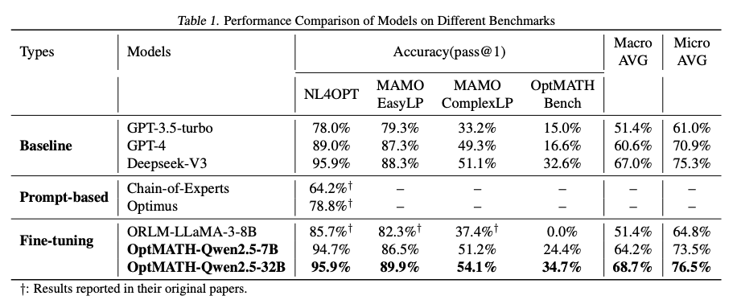
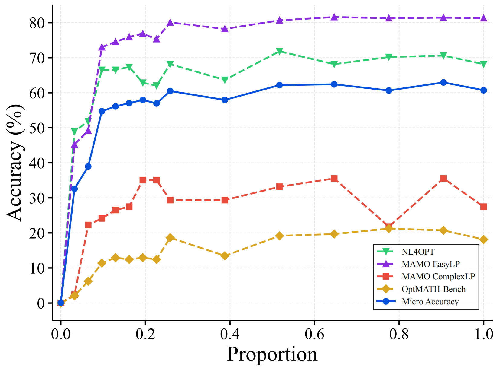

# OptMATH: A Scalable Bidirectional Data Synthesis Framework for Optimization Modeling

<p align="center">
  <a href="https://arxiv.org/abs/2502.11102" style="display: inline-flex; align-items: center; padding: 8px 12px; border-radius: 4px; background-color: #b31b1b; color: white; text-decoration: none;">
    <span style="margin-right: 8px;">📑</span> Paper
  </a>
  <a href="https://huggingface.co/datasets/Aurora-Gem/OptMATH-Train" style="display: inline-flex; align-items: center; padding: 8px 12px; border-radius: 4px; background-color: #ffb7c5; color: black; text-decoration: none; margin-left: 8px;">
    <span style="margin-right: 8px;">🤗</span> Dataset
  </a>
  <a href="https://github.com/optsuite/OptMATH/stargazers" style="display: inline-flex; align-items: center; padding: 8px 12px; border-radius: 4px; background-color: #24292e; color: white; text-decoration: none; margin-left: 8px;">
    <span style="margin-right: 8px;">⭐</span> GitHub Stars
  </a>
   <a href="https://auroralhl.github.io/projects/optmath/" style="display: inline-flex; align-items: center; padding: 8px 12px; border-radius: 4px; background-color: #1769ff; color: white; text-decoration: none; margin-left: 8px;">
    <span style="margin-right: 8px;">🌐</span> Website
  </a>
</p>

## Overview

OptMATH is a scalable framework for synthesizing high-quality optimization modeling datasets. The framework consists of a bidirectional pipeline that:

1. Generates problem data (PD) with controllable complexity from seed mathematical formulations (MF)
2. Creates natural language (NL) descriptions through backtranslation
3. Validates the correspondence between NL and PD through forward modeling and rejection sampling
   

## Key Features

- **Scalable** data synthesis framework for optimization modeling
- Coverage of 10+ real-world applications through 53 seed generators
- Released **OptMATH-Train** with **over 200K high-quality training instances** and **OptMATH-Bench**, a challenging benchmark pushing the boundaries of LLM capabilities
- State-of-the-art performance on multiple benchmarks

## Dataset

OptMATH consists of two main components:

### OptMATH-Train

- Over 200k high-quality and diverse optimization problems.
- Covers diverse optimization scenarios including logistics, supply chain, manufacturing etc.
  

### OptMATH-Bench

A challenging benchmark comprising "hard instances" characterized by:

- Extended natural language contexts (2.9× longer than MAMO EasyLP)
- Complex constraints
- **Coverage of various problem types (LP, MILP, IP, NLP, SOCP)**
  

## Results

We use the LLaMAFactory framework for fine-tuning. For more details, please refer to **[https://github.com/hiyouga/LLaMA-Factory](https://github.com/hiyouga/LLaMA-Factory)**.

### Main Results

The primary results are presented in Table 1. First, our best-performing model, OptMATH-Qwen2.5-32B, achieves superior performance across all benchmarks, surpassing proprietary large language models such as GPT-3.5-Turbo, GPT4, and Deepseek-V3, despite these models having tens of times more parameters. Furthermore, our OptMATH-Qwen2.5-7B outperforms ORLM-LLaMA-3-8B, a model of comparable size, on all benchmarks and demonstrates performance only marginally inferior to Deepseek-V3. Collectively, these results demonstrate that **training with OptMATH-Train significantly enhances the model's optimization modeling capabilities.**


### Ablation Study

#### Ablation study on Model Size


#### Ablation study on Data Size

As shown in the figure below, the performance of Qwen2.5-1.5B across different benchmarks varies with the amount of training data. The model demonstrates **notable improvements in optimization modeling capabilities even with a small portion of the OptMATH-Train dataset.** The performance gains gradually level off as more training data is added, showing a typical diminishing returns pattern.


## Citation

```
@inproceedings{Lu2025OptMATHAS,
  title={OptMATH: A Scalable Bidirectional Data Synthesis Framework for Optimization Modeling},
  author={Hongliang Lu and Zhonglin Xie and Yaoyu Wu and Can Ren and Yuxuan Chen and Zaiwen Wen},
  year={2025},
  url={https://api.semanticscholar.org/CorpusID:276407996}
}
```

## Contact

We hope that the package is useful for your application. If you have any bug reports or comments, please feel free to email one of the toolbox authors:

- Hongliang Lu,  lhl@pku.edu.cn.
- Zhonglin Xie, [zlxie@pku.edu.cn](mailto:zlxie@pku.edu.cn)
- Zaiwen Wen, [wenzw@pku.edu.cn](mailto:wenzw@pku.edu.cn)

